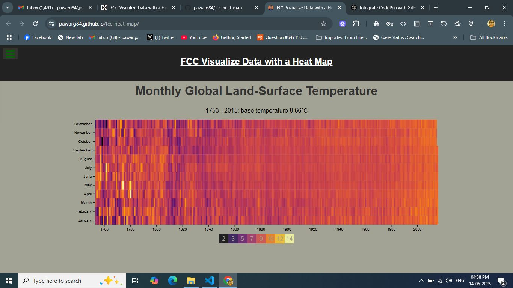

# 🌡️ FCC Visualize Data with a Heat Map

An interactive D3 + React-based heat map that visualizes global land-surface temperature data from 1753 to 2015. Built as part of the FreeCodeCamp Data Visualization Certification projects.

> ✅ **Live Demo:**  
> 🔗 [https://pawarg84.github.io/fcc-heat-map/](https://pawarg84.github.io/fcc-heat-map/)

---

## 📸 Screenshot

---

## 📊 Features

- Monthly global land-surface temperature heatmap
- D3.js for scales, color interpolation, and axes
- React (via CDN) for component structure
- Dynamic tooltip on hover
- Custom legend and color scale
- Responsive SVG rendering
- FCC test suite integrated

---

## 🛠️ Tech Stack

- HTML, CSS
- React 16 (CDN)
- D3.js v4
- Babel (for JSX support)
- FCC Test Suite

---

## 📁 Project Structure

fcc-heat-map/
├── index.html
├── script.js
├── style.css
├── screenshot.png
└── README.md

---

## 🧾 Original CodePen

This project was originally created on CodePen:  
🔗 [https://codepen.io/ganeshp007/pen/qBGVRPR](https://codepen.io/ganeshp007/pen/qBGVRPR)

---

## 🎓 Certification

This project is part of the **FreeCodeCamp - Data Visualization Certification**  
🔗 [freecodecamp.org](https://www.freecodecamp.org/)

---

## 📦 Deployment

Deployed with **GitHub Pages**  
🔗 [https://pawarg84.github.io/fcc-heat-map/](https://pawarg84.github.io/fcc-heat-map/)

---

## 🙌 Author

**Ganesh Pawar**  
🔗 [GitHub @pawarg84](https://github.com/pawarg84)
